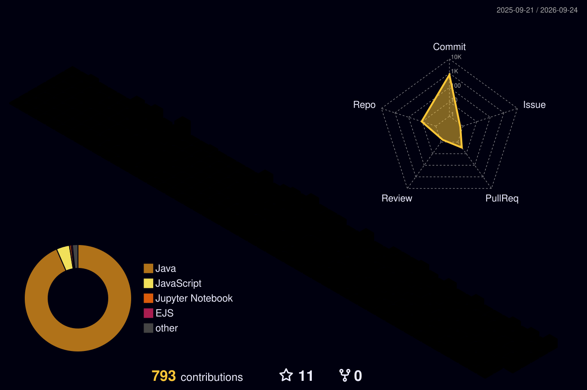

<picture>
  <source media="(prefers-color-scheme: dark)" srcset="./profile-3d-contrib/profile-night-rainbow.svg">
  <source media="(prefers-color-scheme: light)" srcset="./profile-3d-contrib/profile-season.svg">
  
</picture>

### {{name}} — what these towers mean

- **Tall** weeks = pairing on greenfield work
- **Flat** stretches = vacations or deep-research weeks
- **Spiky** weekends = side projects, [{{website}}]({{website_url}})
